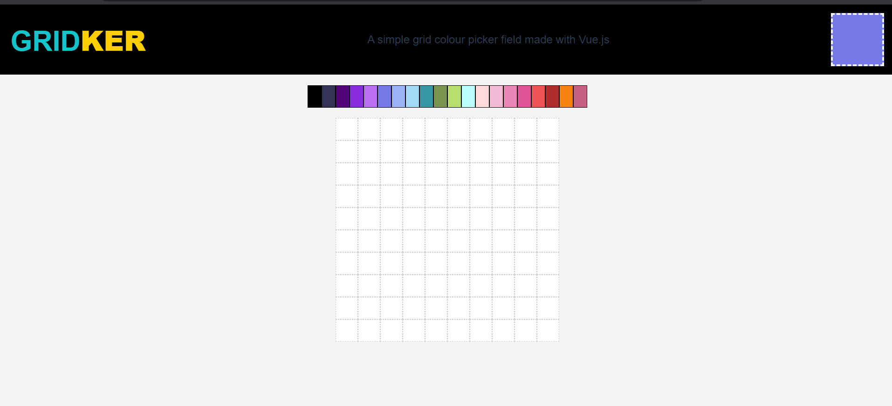
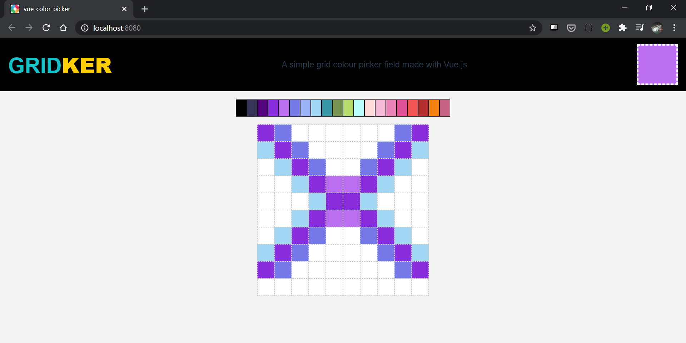

# GridKer
It is color picker that I made using my newest skill, Vue.js. 
It is a color picker and color grid where you can use each pixel to create Pixel Art.







## Project setup
```
npm install
```

### Compiles and hot-reloads for development
```
npm run serve
```

### Compiles and minifies for production
```
npm run build
```

### Lints and fixes files
```
npm run lint
```

### Customize configuration
See [Configuration Reference](https://cli.vuejs.org/config/).
